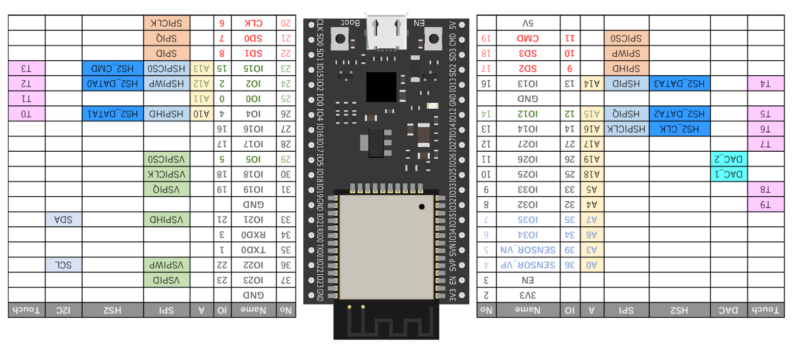
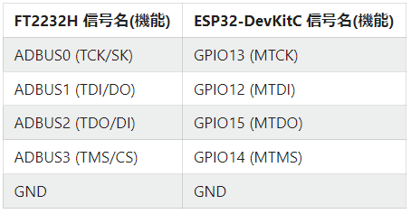
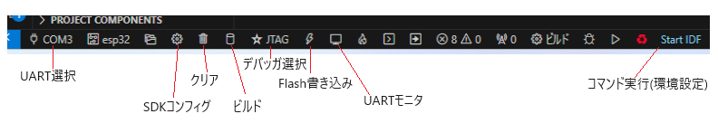

# ESP-IDFのインストール

VSCodeを起動し、左端の拡張機能のアイコンをクリック
上部のボックスに　Espressif IDF　と入力し、「Espressif IDF」のアイコンをクリックしインストール
「Welcome to Espressif IDF extension」の画面が出たら「New
Project」をクリックし画面更新後に出てくる指示にしたがい、インストールを完了する。

※実行前には、Windowsの設定のシステムの設定で、必ず以下の設定が実施されていること

    HTTP_PROXY=http://[User Name]:[password]@[proxyアドレス]:[サービスポート]  
    HTTPS_PROXY=http://[User Name]:[password]@[porxyアドレス]:[サービスポート]


# FreeRTOS関連のソースのインストール

以下のGitHubからFreeRTOSなどの関連ファイル一式をcloneする。

ディレクトリ構成の例を下記に示す。

```
esp ----- esp-idf　　　　　　　　　　　　　　　　ESPの各種モジュールなど
      |
      +-- Projects ---- esp-aws-iot　　　　　　coreMQTTなどのライブラリが格納
                     +- FreeRTOS			  FreeRTOS関係のコードが格納

```

* gitクローン時のコマンドラインは、下記のように、recursiveを指定してリンク先もクローンする
```
git clone --recursive [github url]
```
以下にクローン時のURLを示す。

* esf-idfのダウンロード：
 			https://github.com/espressif/esp-idf.git

* esp-aws-iotのダウンロード：
			https://github.com/espressif/esp-aws-iot.git

* FreeRTOSのダウンロード：
			https://github.com/FreeRTOS/FreeRTOS.git

※　git実施時には、proxyが存在する場合は、HTTP_PROXYの設定が実施されていること


# FT232HLを用いたJTAGデバッグ環境の構築

以下にFT232HLを使用したJTAGデバッグ環の構築方法を記載する。

## システム構成と結線

以下に、ESP32のボードとFT232HLのピン間の結線とESP32のピン配置図を示す。

<div style="text-align:center"><br><center>ESP32ピン配置図


</div>

## ツールの設定

以下に使用するドライバー、ツールに関して記載する。

以下の場所からドライバーZadigをダウンロードし、インストールを行う。

URL:https://zadig.akeo.ie/

起動後に、下記URLの情報を参考にドライバーの設定を実施

URL：https://qiita.com/ain1084/items/6b6451ca44234c6cc628

# コマンド実行ボタンの対応

画面下部にコマンド実行用ボタンを作成する方法に関して記載する。拡張機能として、VsCode Action Button をインストールしておく。
setting.jsonをCtrl+Shift+P　以降の操作で表示し、下記の"actionButtons"からを設定。
下記の例では、"Start IDF"にESP-IDFの環境設定を行う一連のコマンド実行を設定している。
下記では、ユーザ名をtakoとして表記している。

```
{
    "files.autoGuessEncoding": true,
    "window.menuBarVisibility": "compact",
    "idf.gitPathWin": "C:\\Users\\tako\\.espressif\\tools\\idf-git\\2.39.2\\cmd\\git.exe",
    "idf.pythonBinPath": "C:\\Program Files (x86)\\Python\\Python311\\python",
    "idf.pythonBinPathWin": "C:\\Users\\tako\\.espressif\\python_env\\idf5.1_py3.11_env\\Scripts\\python.exe",
    "idf.espIdfPathWin": "C:\\Users\\tako\\esp\\esp-idf",
    "idf.toolsPathWin": "C:\\Users\\tako\\.espressif",
    "idf.customExtraPaths": "C:\\Users\\tako\\.espressif\\tools\\xtensa-esp-elf-gdb\\12.1_20221002\\xtensa-esp-elf-gdb\\bin;C:\\Users\\tako\\.espressif\\tools\\riscv32-esp-elf-gdb\\12.1_20221002\\riscv32-esp-elf-gdb\\bin;C:\\Users\\tako\\.espressif\\tools\\xtensa-esp32-elf\\esp-12.2.0_20230208\\xtensa-esp32-elf\\bin;C:\\Users\\tako\\.espressif\\tools\\xtensa-esp32s2-elf\\esp-12.2.0_20230208\\xtensa-esp32s2-elf\\bin;C:\\Users\\tako\\.espressif\\tools\\xtensa-esp32s3-elf\\esp-12.2.0_20230208\\xtensa-esp32s3-elf\\bin;C:\\Users\\tako\\.espressif\\tools\\riscv32-esp-elf\\esp-12.2.0_20230208\\riscv32-esp-elf\\bin;C:\\Users\\tako\\.espressif\\tools\\esp32ulp-elf\\2.35_20220830\\esp32ulp-elf\\bin;C:\\Users\\tako\\.espressif\\tools\\cmake\\3.24.0\\bin;C:\\Users\\tako\\.espressif\\tools\\openocd-esp32\\v0.12.0-esp32-20230921\\openocd-esp32\\bin;C:\\Users\\tako\\.espressif\\tools\\ninja\\1.10.2;C:\\Users\\tako\\.espressif\\tools\\idf-exe\\1.0.3;C:\\Users\\tako\\.espressif\\tools\\ccache\\4.8\\ccache-4.8-windows-x86_64;C:\\Users\\tako\\.espressif\\tools\\dfu-util\\0.11\\dfu-util-0.11-win64;C:\\Users\\tako\\.espressif\\tools\\esp-rom-elfs\\20230320",
    "idf.customExtraVars": {
        "OPENOCD_SCRIPTS": "C:\\Users\\tako\\.espressif\\tools\\openocd-esp32\\v0.12.0-esp32-20230921/openocd-esp32/share/openocd/scripts",
        "IDF_CCACHE_ENABLE": "1",
        "ESP_ROM_ELF_DIR": "C:\\Users\\tako\\.espressif\\tools\\esp-rom-elfs\\20230320/"
    },
    "hediet.vscode-drawio.resizeImages": null,
    "git.openRepositoryInParentFolders": "never",
    "cmake.showOptionsMovedNotification": false,
    "cmake.configureOnOpen": false,
    "actionButtons": {
        "defaultColor": "#ff0034", // Can also use string color names.
        "loadNpmCommands":false, // Disables automatic generation of actions for npm commands.
        "reloadButton":"♻️", // Custom reload button text or icon (default ↻). null value enables automatic reload on configuration change
        "commands": [
            {
                "name": "Start IDF",
                "color": "skyblue",
                "singleInstance": true,
								"command": "C:/WINDOWS/system32/cmd.exe /k \"\"C:/Espressif/idf_cmd_init.bat\" esp-idf-320ad5a1f7f1ffa6c2d9808f7d43bb34\"",
            }
        ]
    }
}  
```

# JTAGによるデバッグ方法

* VSCodeを起動  
* ソフトを開く  
* 画面左の下図のアイコンをクリックし、デバッグと実行をクリック

   

* lanuch.jsonが以下であること確認。  elfはプロジェクトに合わせる 


```
{
    // IntelliSense を使用して利用可能な属性を学べます。
    // 既存の属性の説明をホバーして表示します。
    // 詳細情報は次を確認してください: https://go.microsoft.com/fwlink/?linkid=830387
    "version": "0.2.0",
    "configurations": [
        {
            "name":  "ESP32 OpenOCD",
            "type":  "cppdbg",
            "request": "launch",
            "cwd": "${workspaceFolder}/build",
            "program": "${workspaceFolder}/build/udp_multicast.elf",
            "miDebuggerPath": "C:/Users/tako/.espressif/tools/xtensa-esp-elf-gdb/12.1_20221002/xtensa-esp-elf-gdb/bin/xtensa-esp32-elf-gdb.exe",
            "setupCommands": [
                {"text": "target remote 127.0.0.1:3333"},
                {"text": "set remote hardware-watchpoint-limit 2"},
                {"text": "monitor reset halt"},
                {"text": "flushregs"}
            ]
        }
    ]
}
```

* ターゲットに実行ファイルを書き込んでおく

* 環境を設定するため、VSCodeのターミナル上で以下を実行。VSCodeのターミナルは、「表示」→「ターミナル」で開く。  
　（コマンドの内容は、ESP-IDF CMDをインストール時にできたコマンドプロンプトアイコンのプロパティの設定）  
　コマンド実行ボタンで下記を設定している場合は、該当するコマンド実行ボタンをクリックする

```
C:\WINDOWS\system32\cmd.exe /k ""C:\Espressif\idf_cmd_init.bat" esp-idf-320ad5a1f7f1ffa6c2d9808f7d43bb34"
```

* デバッグ環境設定のため、VSCodeのターミナル上で以下を実行

```
openocd -f board/esp32-wrover-kit-3.3v.cfg
```

# 操作時のアイコン

VSCOdeの下部に下図が表示される。各アイコンの意味は図中に記載の通りである

<br>操作時アイコン

VSCode ACtion Button拡張機能をインストールする
Ctrl＋Shift＋Pで、コマンド入力欄で「基本設定：ユーザ設定を開く（JSON)」を選択する。
下記のようなJSONが表示されるので、(1)の部分に、コマンド名、実行ファイル（BAT）を記載する。

``` 
{
    "files.autoGuessEncoding": true,
    "window.menuBarVisibility": "compact",
    "idf.gitPathWin": "C:\\Users\\morim\\.espressif\\tools\\idf-git\\2.39.2\\cmd\\git.exe",
    "idf.pythonBinPath": "C:\\Program Files (x86)\\Python\\Python311\\python",
    "idf.pythonBinPathWin": "C:\\Users\\morim\\.espressif\\python_env\\idf5.1_py3.11_env\\Scripts\\python.exe",
    "idf.espIdfPathWin": "C:\\Users\\morim\\esp\\esp-idf",
    "idf.toolsPathWin": "C:\\Users\\morim\\.espressif",
    "idf.customExtraPaths": "C:\\Users\\morim\\.espressif\\tools\\xtensa-esp-elf-gdb\\12.1_20221002\\xtensa-esp-elf-gdb\\bin;C:\\Users\\morim\\.espressif\\tools\\riscv32-esp-elf-gdb\\12.1_20221002\\riscv32-esp-elf-gdb\\bin;C:\\Users\\morim\\.espressif\\tools\\xtensa-esp32-elf\\esp-12.2.0_20230208\\xtensa-esp32-elf\\bin;C:\\Users\\morim\\.espressif\\tools\\xtensa-esp32s2-elf\\esp-12.2.0_20230208\\xtensa-esp32s2-elf\\bin;C:\\Users\\morim\\.espressif\\tools\\xtensa-esp32s3-elf\\esp-12.2.0_20230208\\xtensa-esp32s3-elf\\bin;C:\\Users\\morim\\.espressif\\tools\\riscv32-esp-elf\\esp-12.2.0_20230208\\riscv32-esp-elf\\bin;C:\\Users\\morim\\.espressif\\tools\\esp32ulp-elf\\2.35_20220830\\esp32ulp-elf\\bin;C:\\Users\\morim\\.espressif\\tools\\cmake\\3.24.0\\bin;C:\\Users\\morim\\.espressif\\tools\\openocd-esp32\\v0.12.0-esp32-20230921\\openocd-esp32\\bin;C:\\Users\\morim\\.espressif\\tools\\ninja\\1.10.2;C:\\Users\\morim\\.espressif\\tools\\idf-exe\\1.0.3;C:\\Users\\morim\\.espressif\\tools\\ccache\\4.8\\ccache-4.8-windows-x86_64;C:\\Users\\morim\\.espressif\\tools\\dfu-util\\0.11\\dfu-util-0.11-win64;C:\\Users\\morim\\.espressif\\tools\\esp-rom-elfs\\20230320",
    "idf.customExtraVars": {
        "OPENOCD_SCRIPTS": "C:\\Users\\morim\\.espressif\\tools\\openocd-esp32\\v0.12.0-esp32-20230921/openocd-esp32/share/openocd/scripts",
        "IDF_CCACHE_ENABLE": "1",
        "ESP_ROM_ELF_DIR": "C:\\Users\\morim\\.espressif\\tools\\esp-rom-elfs\\20230320/"
    },
    "hediet.vscode-drawio.resizeImages": null,
    "git.openRepositoryInParentFolders": "never",
    "cmake.showOptionsMovedNotification": false,
    "cmake.configureOnOpen": false,
    "actionButtons": {
        "defaultColor": "#ff0034", // Can also use string color names.
        "loadNpmCommands":false, // Disables automatic generation of actions for npm commands.
        "reloadButton":"♻️", // Custom reload button text or icon (default ↻). null value enables automatic reload on configuration change
ここから→
        "commands": [
ここからが、StartIDF
            {
                "name": "Start IDF",
                "color": "skyblue",
                "singleInstance": true,
                "command": "C:/WINDOWS/system32/cmd.exe /k \"\"C:/Espressif/idf_cmd_init.bat\" esp-idf-320ad5a1f7f1ffa6c2d9808f7d43bb34\"",
            }
ここからが、OpenOCD
            {
                "name": "Open OCD",
                "color": "skyblue",
                "singleInstance": true,
                "command": "openocd -f board/esp32-wrover-kit-3.3v.cfg",
            }
        ]
    },
    "workbench.colorTheme": "Visual Studio Dark - C++",
    "workbench.editorAssociations": {
        "*.c": "default"
    },
    "[cpp]": {
        "editor.wordBasedSuggestions": false,
        "editor.suggest.insertMode": "replace",
        "editor.semanticHighlighting.enabled": true
    },
    "hediet.vscode-drawio.theme": "min"
}
``` 

# はまる点

JTAGでデバッグを起動するが、すぐにエラー画面が表示される場合、以下の２つの手段がある。

・　右の画面で、とかが表示されている部分を一度すべて削除する。その後、StartIDFとOpenOCDを実行し、JTAGデバッガを起動してみる。  

・　上記で解決しない場合、上記のようにプログラムを全て削除し、その後、Start.IDF を実行後に、以下 を実施し、再度、Start.IDF,OpenOCDを実施しJTAGを起動する。  
   
```
　　　　　idf.py fullclean  
```   


